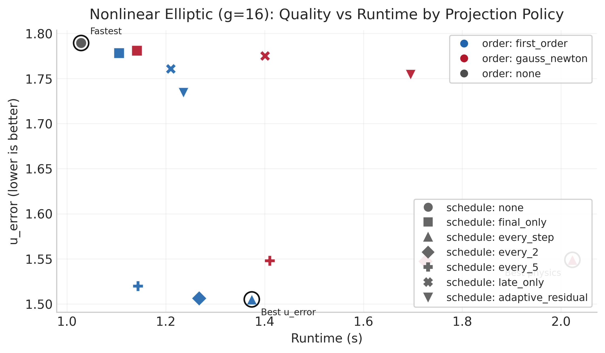
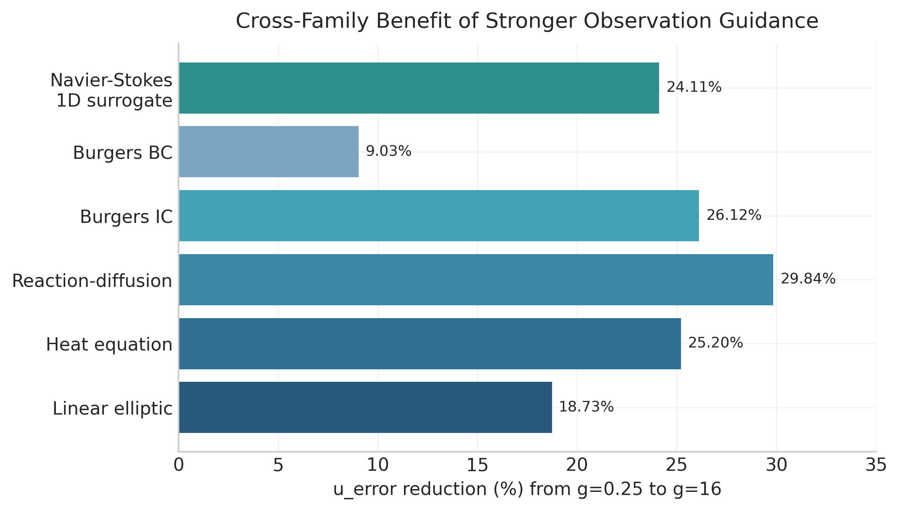

# MEAM 4600 Final Project: Posterior Projection for PDE Generative Sampling

This repository studies a focused inverse-PDE question:

**Which projection schedule and projection order best trade off reconstruction quality, physical consistency, runtime, and trajectory stability?**

## Quick Links

- Final report (PDF): [`reports/final_project_report.pdf`](reports/final_project_report.pdf)
- Final report (LaTeX): [`reports/final_project_report.tex`](reports/final_project_report.tex)
- Nonlinear benchmark summary: [`reports/final_projection_study_summary.md`](reports/final_projection_study_summary.md)
- Multi-family extension summary: [`reports/multifamily_extension_summary.md`](reports/multifamily_extension_summary.md)

## Benchmark and Inverse Setting

- PDE: `-Delta v + 50 v^3 = u`
- Grid: `Nx = 63`
- Boundary condition: periodic
- Inverse target: recover full `u`
- Observations: partial `v`
- Main evaluation protocol: `128` samples x `3` observation seeds

## Results Dashboard

### Table 1. Best inverse reconstruction vs baseline (nonlinear elliptic, full table)

| Setting | `u_error` | `v_error` | `obs_error` | `posterior_quality` | `runtime` |
| --- | ---: | ---: | ---: | ---: | ---: |
| Baseline best row | `1.9232` | `1.2944` | `1.1504` | `4.3679` | `0.7357 s` |
| Best tuned row (`e200_big`, `g=16`, `every_step/first_order`) | `1.5050` | `0.9120` | `0.8126` | `3.2295` | `1.3741 s` |
| Relative change | `-21.75%` | `-29.54%` | `-29.36%` | `-26.06%` | `+86.77%` |

Interpretation: stronger training plus strong observation guidance and every-step first-order projection improves all reconstruction-side metrics (`u_error`, `v_error`, `obs_error`, `posterior_quality`) while increasing runtime.

### Table 2. Objective-wise winners (same evaluation grid)

| Objective | Winning run | Best schedule/order | Value |
| --- | --- | --- | ---: |
| `posterior_quality` | `e200_big + g=16` | `every_5 / gauss_newton` | `3.1364` |
| `physical_consistency` | `e200_big + g=16` | `every_step / gauss_newton` | `0.000359` |
| `runtime` | baseline | `none / none` | `0.6086 s` |
| `trajectory_stability` | baseline | `none / none` | `0.0` |

Interpretation: winners are objective-dependent. `every_5/gauss_newton` gives the best composite posterior score, `every_step/gauss_newton` gives the strongest physics consistency, and no-projection remains fastest and most stable.

### Table 3. Cross-family guidance benefit (`g=0.25 -> g=16`, best-row `u_error`)

| PDE family | `u_error` change |
| --- | ---: |
| Linear elliptic | `-18.73%` |
| Heat equation | `-25.20%` |
| Reaction-diffusion | `-29.84%` |
| Burgers IC | `-26.12%` |
| Burgers BC | `-9.03%` |
| Navier-Stokes 1D surrogate | `-24.11%` |

Interpretation: stronger observation guidance consistently helps inverse recovery across all tested families (range: `-9.03%` to `-29.84%`).

| Nonlinear quality-runtime frontier | Cross-family guidance gains |
| --- | --- |
|  |  |

## Reproducibility (Minimal)

```bash
python -m venv .venv
source .venv/bin/activate
pip install -r requirements.txt
```

```bash
PYTHONPATH=src python -m unittest discover -s tests
```

```bash
PYTHONPATH=src python -m chonkdiff.generate_dataset --config configs/chonkdiff_elliptic.yaml
```

```bash
PYTHONPATH=src python -m posterior_projection.train \
  --config configs/posterior_projection.yaml \
  --checkpoint-dir outputs/posterior_projection_baseline
```

```bash
PYTHONPATH=src python -m posterior_projection.evaluate \
  --checkpoint outputs/posterior_projection_baseline/best.pt \
  --num-samples 128 \
  --num-observation-seeds 3 \
  --json-out outputs/posterior_projection_baseline/eval_full.json \
  --csv-out outputs/posterior_projection_baseline/eval_full.csv
```

## Data and Result Tracking

- Reviewer-facing artifacts are tracked in `reports/`.
- Large run artifacts are generated under `outputs/` (checkpoints, JSON, CSV).
- Key numerical conclusions are mirrored in:
  - `reports/final_projection_study_summary.md`
  - `reports/multifamily_extension_summary.md`

## References and Attribution

- Physics-Constrained Flow Matching (PCFM):
  - local copy: [`final_project/references/papers/pcfm.pdf`](final_project/references/papers/pcfm.pdf)
  - project page: https://caipengfei.me/pcfm
- DiffusionPDE:
  - local copy: [`final_project/references/papers/diffusionpde.pdf`](final_project/references/papers/diffusionpde.pdf)
  - paper page: https://proceedings.neurips.cc/paper_files/paper/2024/hash/eb3878c1dcbfff9ee95d5d033e5f5942-Abstract-Conference.html

## Technical Appendix (Detailed Notes)

This repository is the standalone final-project codebase for studying one research question:

Which projection schedule and which projection order are best for posterior quality, physical consistency, runtime, and trajectory stability in PDE generative sampling?

The project focuses on inverse posterior sampling for a 1D nonlinear elliptic PDE and compares when physics projection should be applied during sampling and how strong that projection should be.

## Problem Overview

We work with the nonlinear elliptic benchmark

```text
-Delta v + kappa v^3 = u
```

with:

- periodic boundary conditions
- `kappa = 50`
- `N_x = 63`

The inverse setting is:

- unknown: full forcing `u`
- observed: partial entries of the solution `v`
- target: posterior samples of the joint state `(u, v)` that both fit the observations and satisfy the PDE

This project does not claim exact posterior density estimation in v1. Instead, it studies practical posterior-sampling behavior using oracle errors, observation fit, PDE residual, runtime, and trajectory deviation.

## Core Research Question

The project compares projection strategies along two axes:

- projection schedule
  - `none`
  - `final_only`
  - `every_step`
  - `every_2`
  - `every_5`
  - `late_only`
  - `adaptive_residual`
- projection order
  - `first_order`
  - `gauss_newton`

The four target objectives are:

- posterior quality
- physical consistency
- runtime
- trajectory stability

The point is not only to ask whether projection helps, but to identify which projection strategy is best for which target.

## Mathematical Definition

We model the joint state

```text
x = [u, v] in R^(2 x N_x)
```

and the PDE residual

```text
h(u, v) = -Delta v + kappa v^3 - u.
```

The inverse problem conditions on sparse observations of `v`. If `M` is the observation mask and `y` is the observed data, then:

```text
L_obs(x) = || M odot (v - y) ||_2^2 / max(1, |M|).
```

The study evaluates each projection strategy `(S, q)` using:

```text
J_post  = posterior-quality surrogate from oracle errors and observation fit
J_phys  = || h(u, v) ||_2^2
J_time  = total runtime including projection cost
J_traj  = sum_k || x_k^(proj) - x_k^(base) ||_2^2
```

where:

- `S` is the projection schedule
- `q` is the projection order

## Method

### 1. Joint generative prior

We train an unconditional joint flow-matching prior on oracle pairs `(u, v)`.

- model: compact 1D FNO-style vector field
- implementation: `src/posterior_projection/model.py`
- flow-matching objective: `src/posterior_projection/flow.py`

Training uses:

- `x_0 ~ N(0, I)`
- `x_1 ~ p_data(u, v)`
- `x_t = (1 - t) x_0 + t x_1`
- target velocity `x_1 - x_0`

### 2. Posterior sampling

At inference time:

- sample a joint initial state from Gaussian noise
- integrate the learned vector field with explicit Euler
- apply observation guidance on `v`
- apply physics projection according to the chosen schedule and order

Implementation:

- posterior pipeline: `src/posterior_projection/pipeline.py`
- problem wrapper: `src/posterior_projection/problem.py`

### 3. Projection orders

First-order projection:

```text
x_proj = x - J^T (J J^T + lambda I)^(-1) h(x)
```

Second-order projection:

- damped Gauss-Newton / Newton-KKT style correction
- float64 linear algebra
- line search
- small iteration budget

Implementation:

- `src/posterior_projection/projection.py`

### 4. Backend benchmark/oracle layer

The final-project learner lives in `src/posterior_projection`.

The nonlinear elliptic benchmark and oracle dataset generation live in `src/chonkdiff` and are reused only as the numerical backend:

- `src/chonkdiff/benchmark.py`
- `src/chonkdiff/oracle.py`
- `src/chonkdiff/dataset.py`
- `src/chonkdiff/generate_dataset.py`

## Environment Setup

### Python

- Python `>= 3.12`
- package root: `src/`
- commands are typically run with `PYTHONPATH=src`

### Dependencies

`requirements.txt` contains the final-project dependencies:

- `torch`
- `numpy`
- `scipy`
- `matplotlib`
- `pyyaml`

Recommended setup:

```bash
python -m venv .venv
source .venv/bin/activate
pip install -r requirements.txt
```

Or:

```bash
pip install -e .
```

## Repository Layout

- `configs/posterior_projection.yaml`
  - final-project experiment config
- `configs/chonkdiff_elliptic.yaml`
  - nonlinear elliptic backend/oracle config
- `src/posterior_projection/`
  - main final-project implementation
- `src/chonkdiff/`
  - benchmark/oracle backend
- `tests/`
  - backend and posterior-projection tests
- `final_project/references/`
  - local copies of the key papers and text extracts
- `final_project/notes/experiment_matrix.md`
  - experiment planning notes

## Step-by-Step Plan

### Step 1

Train a joint flow-matching prior on oracle `(u, v)` pairs.

### Step 2

Define the inverse task `u | partial v` by masking most of `v` and conditioning on sparse observations.

### Step 3

Run guided posterior sampling with observation guidance plus schedule-controlled physics projection.

### Step 4

Compare projection schedules to understand when projection should be applied.

### Step 5

Compare first-order versus Gauss-Newton projection to understand when stronger physics correction is worth the cost.

### Step 6

Rank each `(schedule, order)` pair by:

- posterior quality
- physical consistency
- runtime
- trajectory stability

## Current Defaults

From `configs/posterior_projection.yaml`:

- observed fraction: `0.1`
- observation noise: `0.0`
- flow steps: `100`
- observation guidance strength: `2.5e-1`
- training epochs: `80`
- batch size: `64`
- final cleanup: enabled
- final cleanup iterations: `8`

## Commands

### 1. Generate the benchmark dataset

```bash
PYTHONPATH=src python -m chonkdiff.generate_dataset \
  --config configs/chonkdiff_elliptic.yaml
```

### 2. Train the joint prior

```bash
PYTHONPATH=src python -m posterior_projection.train \
  --config configs/posterior_projection.yaml
```

### 3. Sample one posterior trajectory

```bash
PYTHONPATH=src python -m posterior_projection.sample \
  --checkpoint outputs/posterior_projection/best.pt \
  --schedule every_2 \
  --order gauss_newton
```

### 4. Quick evaluation

```bash
PYTHONPATH=src python -m posterior_projection.evaluate \
  --checkpoint outputs/posterior_projection/best.pt \
  --num-samples 4 \
  --num-observation-seeds 1
```

### 5. Larger evaluation

```bash
PYTHONPATH=src python -m posterior_projection.evaluate \
  --checkpoint outputs/posterior_projection/best.pt \
  --num-samples 32 \
  --num-observation-seeds 2 \
  --json-out outputs/posterior_projection/eval_32x2.json \
  --csv-out outputs/posterior_projection/eval_32x2.csv
```

### 6. Run tests

```bash
PYTHONPATH=src python -m unittest discover -s tests
```

## References

The local source archive used for this project is stored in:

- `final_project/references/SOURCE_CATALOG.md`
- `final_project/references/papers/pcfm.pdf`
- `final_project/references/papers/diffusionpde.pdf`
- `final_project/references/text/pcfm.txt`
- `final_project/references/text/diffusionpde.txt`
